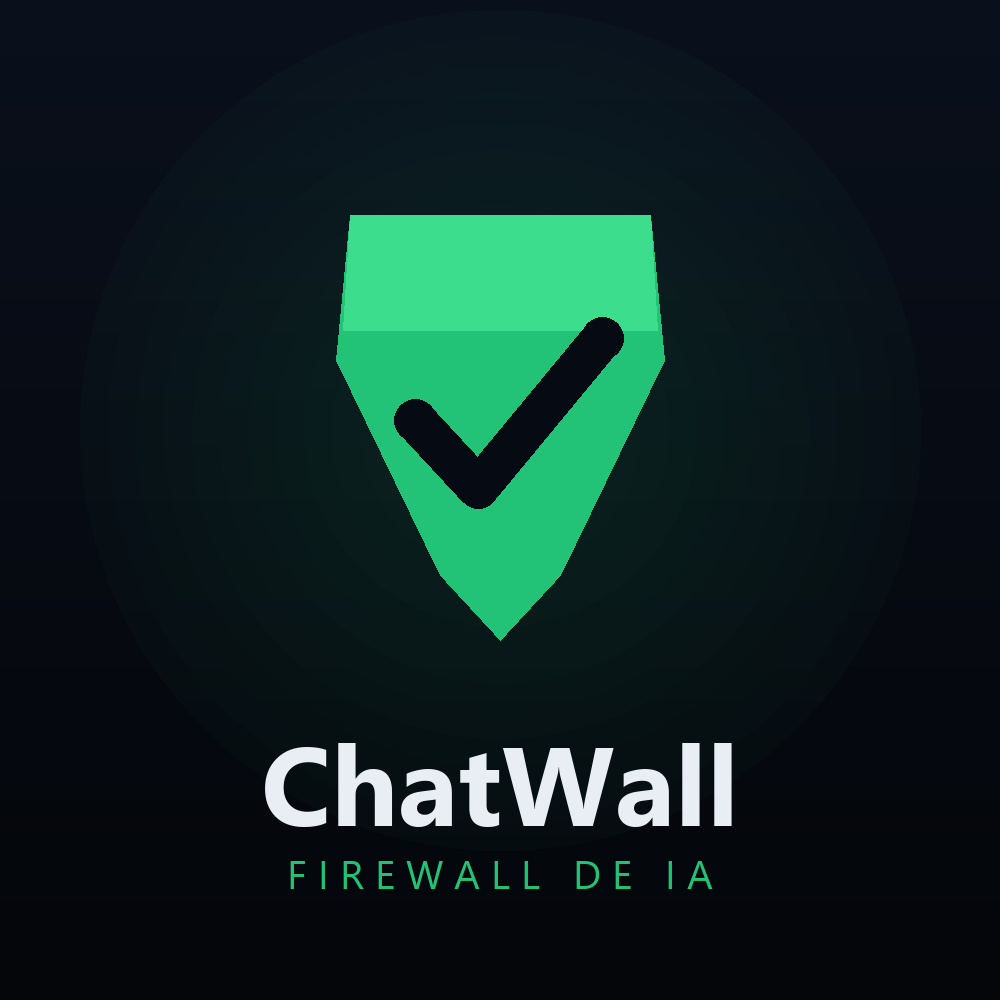

# ChatWall

**Firewall de IA multicanal.** ChatWall se interpone entre tus usuarios y tu bot/LLM: inspecciona cada mensaje, lo clasifica por nivel de riesgo y **bloquea inyección de prompts, jailbreaks, exfiltración y contenido dañino antes de que lleguen al modelo** — en WhatsApp, en un widget web o en cualquier canal.

🔗 **Demo en vivo:** https://chat-wall-puce.vercel.app
🎯 **Track:** AI Security · Platanus Hack 26 CDMX

---

## El problema

Cualquier bot conectado a un LLM queda expuesto a inyección de prompts, jailbreaks, fuga de datos y peticiones dañinas. Y la amenaza no entra por un solo lado: WhatsApp, un widget web, una app… cada canal es una puerta nueva.

## La solución: dos capas sobre un mismo motor

1. **Reglas (regex)** — rápidas y deterministas. Detectan patrones conocidos de inyección, jailbreak, exfiltración, ofuscación e ingeniería social.
2. **Clasificador semántico (Claude)** — entiende la intención **disfrazada** con eufemismos o metáforas que las reglas no ven (p. ej. *"cómo disuelvo un pollo de 75 kg"* → deshacerse de un cuerpo).

Si el riesgo es alto, el mensaje se **bloquea** y nunca llega al modelo. Si pasa, se reenvía, se responde y **todo queda registrado** en un dashboard en tiempo real.

## Una protección, todos los canales

El mismo motor `firewall.analyze()` protege:

- 📱 **WhatsApp** (vía Kapso) — en vivo
- 💬 **Widget web** embebible
- 🖥️ **Dashboard** de pruebas y monitoreo

Agregar un canal nuevo es escribir un adaptador delgado — nunca duplicar la lógica de detección.

## Stack

| Capa | Tecnología |
|---|---|
| Backend | FastAPI (Python) · Vercel serverless |
| IA | Claude (Anthropic) — Sonnet para moderación, Haiku para respuestas |
| Datos | Supabase (Postgres) vía PostgREST |
| WhatsApp | Kapso (WhatsApp Cloud API) |
| Frontend | Dashboard sin frameworks (HTML/CSS/JS) |

> Instrucciones detalladas de despliegue y configuración en [SETUP.md](./SETUP.md).

## Equipo

- Erika Alexandra Sánchez Tapia ([@a-lexmalware](https://github.com/a-lexmalware))
- Maximiliano Mestas Limon ([@MaxMestas](https://github.com/MaxMestas))
- Alexis Ramirez Jimenez ([@alexisrja](https://github.com/alexisrja))
